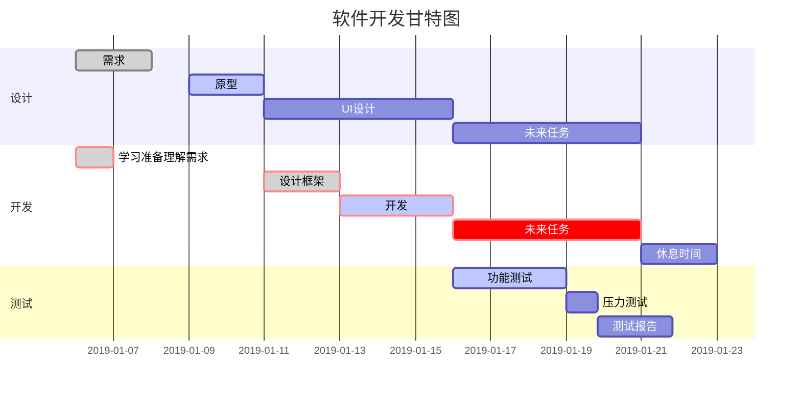
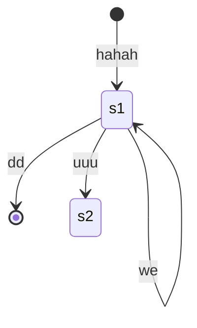
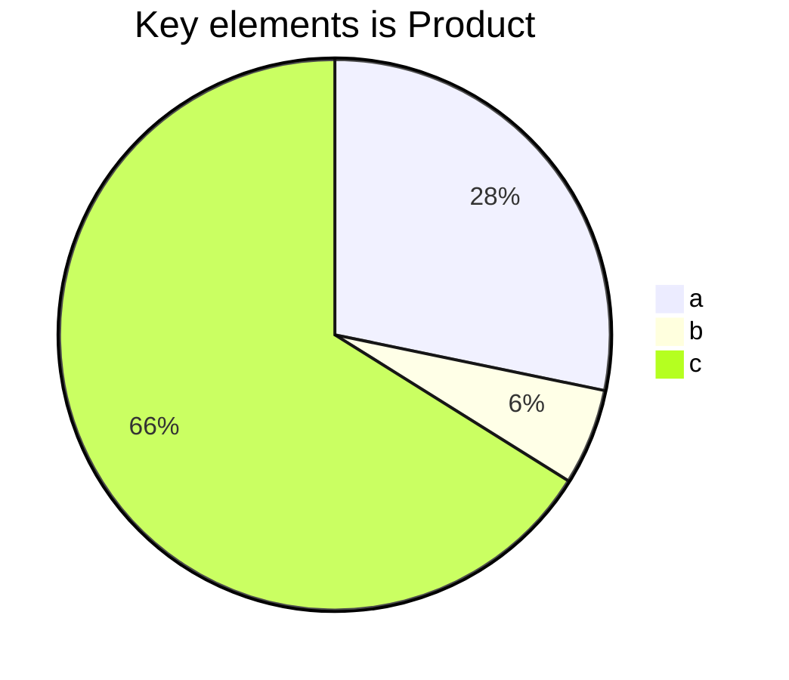

## lesson 1
在线编程网站
https://coderpad.io/
http://collabedit.com/

区块链， 链表，每个node 是 默克尔树

## lesson 2
"outliers",  [《异类：不一样的成功启示录》](https://read.douban.com/ebook/10580943/)

刻意练习， Deliberate Practicing


---
算法题 --- 暴力解法 --- 复杂的多少 --- 优化解法

https://labuladong.gitbook.io/algo/

滑动窗口法
KMP 子串匹配

## lesson 3 复杂度计算

O(1)  
O(N)  
O(N<sup>2</sup>)
嵌套循环  
O(N<sup>3</sup>)  
O(log N)  
O(N!)  
O(2<sup>N</sup>)


计算 1+2+3+4+...+n
for(i=1;i<=n;i++){
    sum +=i;
}
时间复杂度： O(n)

sum = (n+1)*n/2
时间复杂度： O(1)

递归程序的时间复杂度  
[主定理(Master Theorem)](https://zhuanlan.zhihu.com/p/113406812)

---


[markdown plus](http://mdp.tylingsoft.com/)

```sequence
Title:abc
123->abc:what
abc-->123:yes
abc->bbb:en
123->ccc:
```





```flow
st=>start: 开始
ipt=>inputoutput: 输入一个x
op=>operation: 处理加工x+1
cond=>condition: 溢出（是或否？）
sub=>subroutine: 子流程
io=>inputoutput: 输出x
ed=>end: 结束

st->ipt->op->cond
cond(yes)->io->ed
cond(no)->sub->io->ed
```






